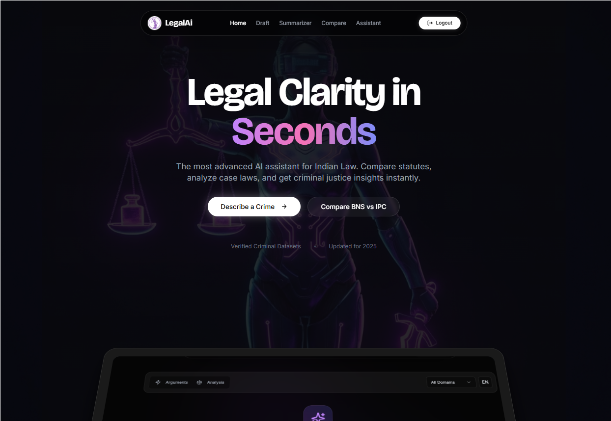

# ⚖️ LegalAi: The Intelligent Justice Engine

**Democratizing Legal Justice with NVIDIA-Powered AI.**
*Winner/Participant at Rubix TSEC Hackathon*

LegalAi is a high-performance **"Judge-Safe"** legal research platform. Designed for both citizens and legal professionals, it bridges the gap between the complex Indian Penal Code (IPC) and the new Bharatiya Nyaya Sanhita (BNS) using state-of-the-art **Retrieval-Augmented Generation (RAG)**.



## 🏗️ The Architecture (Techny & Fancy)

LegalAi is built on a distributed microservices architecture designed for reliability and speed.

### 🧠 Core Intelligence: NVIDIA NIM Integration
We utilize **NVIDIA NIM (NVIDIA Inference Microservices)** for ultra-low latency legal reasoning.
- **Primary Model**: `meta/llama-3.1-70b-instruct` for complex legal analysis and drafting.
- **Secondary Model**: `meta/llama-3.1-8b-instruct` for fast greetings and general intent classification.

### 🔍 Search Engine: The RAG Pipeline
Unlike generic LLMs, LegalAi doesn't hallucinate. It uses a custom **RAG (Retrieval-Augmented Generation)** pipeline:
- **Vector DB**: `ChromaDB` stores thousands of legal statutes and landmark judgments.
- **Embeddings**: `Sentence Transformers (all-MiniLM-L6-v2)` for precise semantic retrieval.
- **Processing**: A 12-stage text cleaning pipeline with OCR support for processing complex PDF legal documents.

### 🛡️ Security & Scalability: API Gateway
A specialized Node.js Gateway ensures the system remains stable and secure:
- **Rate Limiting**: Tiered protection (20 requests/15m for AI, 100 requests/15m for general API) to prevent infrastructure overuse.
- **Dynamic Routing**: Intelligent intent routing between the RAG engine and lightweight classification models.

---

## 🚀 Key Features

### 🏆 "Judge-Safe" Innovations
*   **⚖️ Neutral Legal Analysis**: Instead of giving advice, it breaks down "Key Factors" and "Possible Interpretations", acting like a neutral legal clerk.
*   **🔥🧊 Balanced Arguments**: Instantly generates "Arguments For" and "Arguments Against" a case to assist in strategic brainstorming.
*   **📄 Professional Memo Export**: Convert AI research into a formatted, citation-heavy PDF with one click.

### 🇮🇳 Specialized for India
*   **IPC ↔️ BNS Mapping**: Real-time cross-referencing between old and new Indian laws.
*   **🗣️ Vernacular Intelligence**: Native support for **Hindi** (Input/Output) with voice-to-text integration.
*   **📚 Citation-First**: Every answer is backed by direct links to IndiaCode statutes.

---

## 🛠️ Tech Stack

- **Frontend**: `React` + `Vite` + `Tailwind CSS` + `ShadCN UI`
- **Intelligence**: `NVIDIA NIM API` + `Llama 3.1 70B/8B`
- **Data Engine**: `Python (FastAPI)` + `ChromaDB` + `Sentence Transformers`
- **Orchestration**: `Node.js (Express)` + `http-proxy-middleware` + `Docker`

---

## ⚡ Getting Started

### 📦 Installation
```bash
# Clone the repository
git clone https://github.com/WillyEverGreen/TSEC_LEGAL_AI.git
cd TSEC_LEGAL_AI

# Install all dependencies (Unified Setup)
npm install
```

### 🔑 Environment Setup
Create a `.env` file in the root based on `.env.example`:
```env
NVIDIA_API_KEY=your_nvidia_api_key
VITE_API_URL=http://localhost:8000
```

### 🏃 Running the Engine
Launch the entire stack (Frontend + Gateway + RAG) with a single command:
```bash
npm run dev:all
```
The app will be available at `http://localhost:5173`.

---

## 📦 Deployment

### Docker Compose (Recommended)
```bash
docker-compose -f deployment/docker-compose.yml up --build
```

### Manual Production Start
```bash
npm run build
npm start
```

---

## 📂 System Organization
- `rag_service/`: The heart of the AI—Python FastAPI service managing ChromaDB and NVIDIA NIM.
- `server/`: Node.js Gateway providing rate limiting, proxying, and static file serving.
- `scripts/maintenance/`: Maintenance suite for data ingestion and system setup.
- `deployment/`: Production-grade container configurations.

## 📜 Example Queries
1.  *"What changed in IPC 302 under the new BNS system?"*
2.  *"Draft a balanced legal analysis for a workplace dispute."*
3.  *"Summarize this 50-page judgment and extract key IPC sections."*

---
*Built for the Rubix TSEC Hackathon.*
